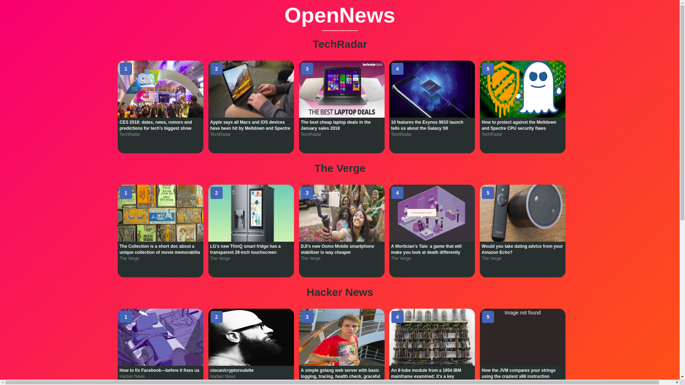
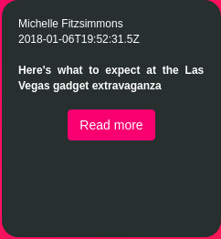

# OpenNews
---------------------------

OpenNews is a simple website which displays the top 5 news from various News sources. The website is basically one page which is divided into several sections in which each section is used to display the top 5 news of a particular News source. Each section contains cards which displays the Image related to the news and the corresponding description.The news gets updated every once in a while to let us updated with latest news.

# Screenshots

 

# Features in a glance

- Minimalistic Design.
- Provides all the latest news in one place !.
- Top 5 news divided into different sections based on the news source.
- Flip cards provides ease in viewing the news.
- Front portion of the Flip card displays News related image and title.
- Back portion of the Flip card displays author,Date of release,description and a button to goto the original news article.

# How to use it

Just click here : [Link](https://aswanthkoleri.github.io/OpenNews/index.html)

# Stacks used 

- HTML
- CSS 
- Vue JS

# How I made it 

Vue JS is used to fetch JSON through the API and the resulting data is stored in an array with the respective names.The data stored in the First 5 index's are used to display the news in the flip cards.The Front end of the website is made by using simple HTML and CSS.The API used in this website is News API.Vue JS was preferred in parsing the JSON because of the simplicity in using it to parse the JSON data. As of now Arrays containing data of only 5 technical websites are present in OpenNews.

# How to Contribute ? 

### :warning: Kindly read this if you are trying to contribute 
 
As of now the webpage is in the intial stage and has a lot of development to `undergo. So a lot of contributions are expected. The website has a lot of issues which are listed in the ***Issue*** section of the repository. Currently, only a brief heading of the issue is provided and that's not sufficient for you to solve the issue. So those who want to solve a particular issue follow these steps : 

- First of all, Comment on the issue in which you are interested in solving.
- If the Issue is seen commented by a person saying that he/she is interested in solving that particular issue then I'll be providing the details and clues on how to solve the issue.Henceforth,assigning that person to solve the issue.
- The Issues are of all types starting from **Easy** to **Medium** and **Hard**. Its your wish to choose the difficulty of the Issue.
- Only comment on one issue at a time.
- if you are assigned on one issue then focus on that.Don't try to solve other issues.
- If any doubts arise on solving the issue then you can comment on the Issue seeking help.

Finally, when sending the pull request kindly follow this pattern : 

- The PR shouldn't have any bugs which can create more issues in the website.
- Provide the Live link while sending the PR.
- Try to avoid Merge conflicts(PR's can't be merged else)
- The PR should have a proper **Title** and a proper series of Commits with proper **Title** if possible.

PR's that are good enough and satisfying will be merged. 

### :warning: Reminder : Comment on the Issues so that I can provide you with proper description and screenshots !.

Good luck contributing ! :smiley: 

